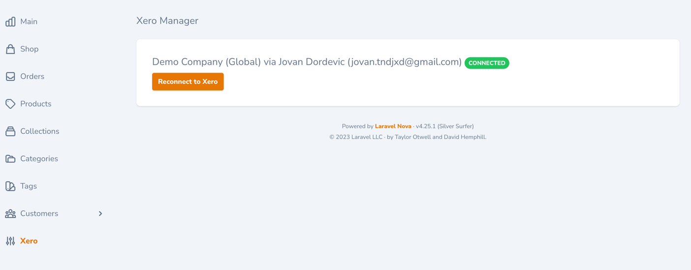

# Nova XeroManager

[](https://github.com/tndjx/xero-manager/blob/master/LICENSE)
[](https://packagist.org/packages/tndjx/xero-manager)
[](https://packagist.org/packages/tndjx/xero-manager)

----
Nova XeroManager is a package based on [laravel-xero-oauth2](https://github.com/webfox/laravel-xero-oauth2)
----

## Requirements:

- PHP 8.0 or higher
- Nova 4

## Installation
To get started just install the package via composer:

```shell
composer require tndjx/xero-manager
```

After that register tool in `NovaServiceProvider`:

```php
public function tools()
{
    return [
        new \Tndjx\XeroManager\XeroManager,
    ];
}
```

That's it, you're ready to go!

#### Screenshot


----


## License

This software is released under [The MIT License (MIT)](LICENSE.txt).
